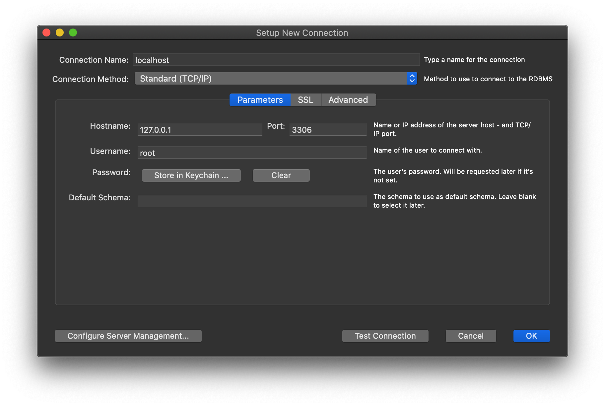

# MySQL 8 con Docker

Instrucciones para arrancar una base de datos MySQL 8 en local mediante Docker.

## Instalación

1. Instalar [Docker Desktop](https://www.docker.com/products/docker-desktop).

2. Clonar este repositorio:

	```
	git clone https://github.com/egibide/mysql8.git
	```

3. En un terminal, situarse en la carpeta `mysql8` (o si se ha renombrado, la que contenga este archivo `README.md`):

	```
	cd mysql8
	```

4. Copiar el fichero `env-example` a `.env`:

	En macOS y Linux:
	
	```
	cp env-example .env
	```
	
	En Windows:
	
	```
	copy env-example .env
	```

	Es recomendable cambiar las contraseñas por defecto.

5. Arrancar los servicios:

	```
	docker-compose up -d
	```

6. Cuando haya arrancado (tarda unos minutos) se puede administrar el servidor mediante [phpMyAdmin](https://localhost:8080).

## MySQL Workbench

La base de datos expone el puerto 3306 en localhost y para conectar desde [MySQL Workbench](https://www.mysql.com/products/workbench/):


